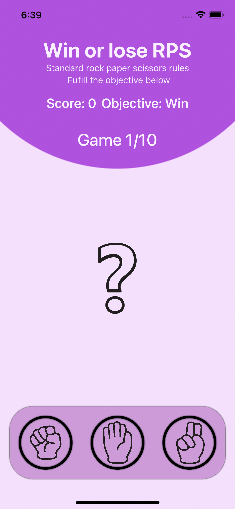

# Win-or-Lose-RPS
Challenge(Day 25) of Hacking With Swift

## How to play
 - Each turn of the game the app will randomly pick either rock, paper, or scissors.
 - Each turn the app will alternate between prompting the player to win or lose.
 - The player must then tap the correct move to win or lose the game.
 - If they are correct they score a point; otherwise they lose a point.
 - The game ends after 10 questions, at which point their score is shown.
<!-- end of the list -->
So, if the app chose “Rock” and “Win” the player would need to choose “Paper”, but if the app chose “Rock” and “Lose” the player would need to choose “Scissors”.

## Ressources
<a href="https://www.vecteezy.com/free-vector/rock-paper-scissors">Rock Paper Scissors Vectors by Vecteezy</a> 
<a href="https://www.hackingwithswift.com/100/swiftui/25">100 Days of SwiftUI - Day 25</a>